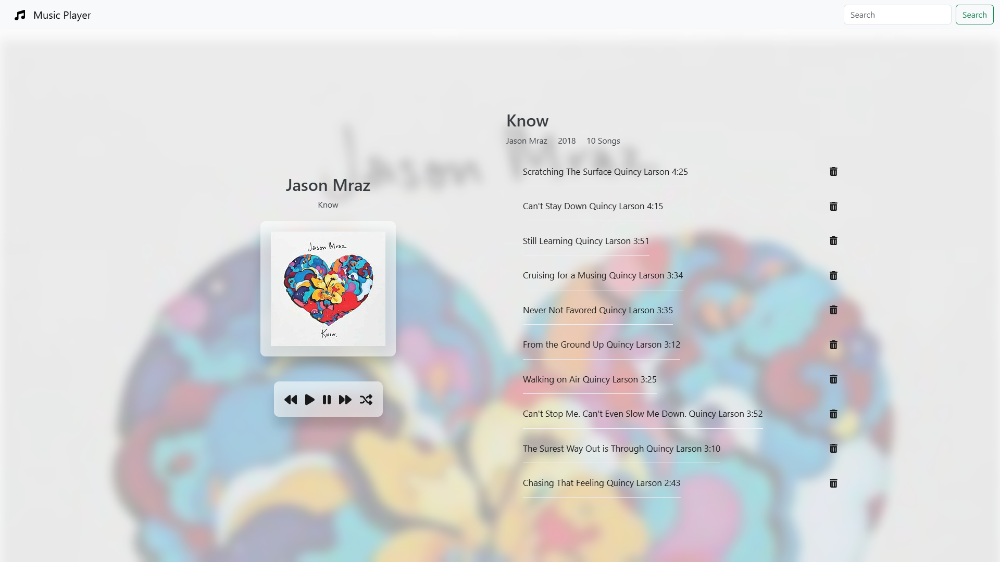

# 🎵 Music Player

A clean and simple web music player built with HTML, CSS, and JavaScript. Users can play, pause, skip tracks, and enjoy a responsive UI with smooth transitions.

> 🔗 Featured on [LinkedIn Post](https://www.linkedin.com/posts/abd-el-rahman-adel-dev_javascript-html-css-activity-7244856652665917440-UknD?utm_source=share&utm_medium=member_desktop&rcm=ACoAAEah8IkBjMk2EJi1EE6Ixmd0ZbtCvA9HqIg)

---

## 🚀 Live Demo

🎧 [Try it Live](https://abd-el-rahman-adel-dev.github.io/CodeAlpha_Tasks_MusicPlayer/)

---

## 📸 Screenshot

 <!-- Replace with actual screenshot if available -->

---

## ✨ Features

- ▶️ Play/Pause functionality
- ⏭️ Next & Previous track controls
- 📃 Dynamic song list
- 📱 Responsive design
- 🎨 Custom UI using only HTML/CSS/JS

---

## 🛠 Tech Stack

- **HTML5**
- **CSS3**
- **JavaScript (Vanilla)**

---

## 📦 How to Run Locally

1. Clone the repository:
```bash
git clone https://github.com/abd-el-rahman-adel-dev/CodeAlpha_Tasks_MusicPlayer.git
